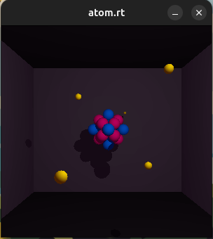
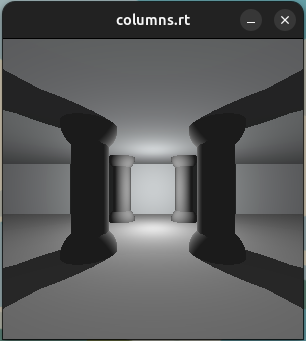
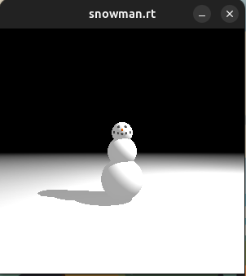

# miniRT

A small ray tracer written in C with MiniLibX, developed as part of the Hive Helsinki / 42 curriculum.

This project renders simple 3D scenes described in a `.rt` file by casting rays from the camera into the scene and computing intersections, ambient lighting, diffuse lighting, and hard shadows for the supported objects.

In this implementation, the supported primitive objects are:

- sphere
- plane
- cylinder

The program also includes keyboard controls for moving the camera, light, and scene objects after launch, making it possible to inspect and adjust the scene interactively.

## About the project

`miniRT` is an introductory computer graphics project focused on the fundamentals of ray tracing:

- parsing a scene description file
- representing cameras, lights, and objects in 3D space
- computing ray-object intersections
- calculating surface normals
- applying ambient + diffuse lighting
- handling shadows
- rendering the final image pixel by pixel into a window

## Collaboration note

This project was originally completed as a two-person collaboration at Hive Helsinki.

The version in this repository is my own project mirror, exported later to GitHub from the school environment. Because of that, the original collaboration history is not fully visible here, even though the implementation itself was developed jointly and both contributors worked on substantial parts of the project.

## Hive Helsinki / 42 constraints

Like other Hive Helsinki projects, this one follows the school’s strict project constraints and coding style rules.

That means some implementation choices may look unusual compared to typical production C projects. In particular, the code structure and function decomposition were influenced by:

- the Norm coding standard
- the allowed-function restrictions
- the project’s educational goals

## Features

- Parse scene description files with the `.rt` extension
- Validate scene input and reject malformed configurations with explicit error messages
- Render scenes containing:
  - one ambient light
  - one camera
  - one point light
  - multiple planes, spheres, and cylinders
- Per-pixel ray casting
- Ray-object intersection handling for:
  - planes
  - spheres
  - cylinders (including caps)
- Ambient lighting
- Diffuse lighting
- Hard shadows
- Camera orientation handling from normalized direction vectors
- Interactive keyboard controls for:
  - object selection
  - object translation
  - object rotation
  - sphere/cylinder resizing
  - camera translation
  - camera rotation
  - light translation
  - light brightness adjustment
  - ambient light brightness adjustment

## Build

On Linux, MiniLibX requires X11-related dependencies.
```bash
sudo apt update
sudo apt install build-essential libx11-dev libxext-dev libbsd-dev xorg
```
Then run `make` inside the root folder.  
This will:
- build libft (library of custom basic functions we created earlier)
- clone minilibx-linux if it is not already present
- build MiniLibX
- compile the project into the miniRT executable

It is also possible to define the window size when running `make`, for example:
```bash
make WIN_WIDTH=1600 WIN_HEIGHT=1024
```
The default 300x300 size was chosen due to significant slowdown observed while testing, especially in more complex scenes.

## Run

Launch the program with a scene file, for example:
```bash
./miniRT scenes/columns.rt
```

## Scene format

This implementation expects a .rt file containing identifiers for:
- A (ambient light)
- C (camera)
- L (light)
- cy (cylinder)
- sp (sphere)
- pl (plane)

Each one can have different variables to determine their size and colour.  
For example:
```text
A 0.2 255,255,255
C 0,5,-14 0,0,1 90
L 0,5,5 1.0 250,250,250

cy -5,0,-2 0,1,0 2.8 20 140,140,140
sp 5,0,10 4.2 140,140,140
pl 0,0,0 0,1,0 200,200,200
```

- The file must use the .rt extension
- Orientation vectors must be normalized.
- Colour values are expected in RGB format in the range 0-255.
- Light and ambient brightness values must be in the range 0.0-1.0.
- The parser accepts empty lines and flexible spacing.
- Invalid input should produce an Error message and exit cleanly.

There are several example scenes provided in the scenes folder.

## Controls

When the program starts, it prints the available controls to the terminal.

### Object controls
- Select previous / next object: - / =
- Move on X: ← / →
- Move on Y: Space / Ctrl
- Move on Z: ↑ / ↓
- Rotate around X: J
- Rotate around Y: K
- Rotate around Z: L
- Resize diameter: , / .
- Resize height: N / M

### Camera controls
- Move on X: A / D
- Move on Y: R / F
- Move on Z: W / S
- Rotate around X: Z / X
- Rotate around Y: Q / E
- Rotate around Z: C / V

### Light controls
- Move on X: 4 / 6
- Move on Y: 7 / 1
- Move on Z: 8 / 5
- Brightness: 9 / 3

### Ambient light
- Brightness: [ / ]

### Exit
- ESC
- window close button

## Implementation notes

The renderer is built around a straightforward ray tracing pipeline:
1. Parse and validate the scene file
2. Initialize MiniLibX and the render buffer
3. For each pixel:
    - generate a camera ray
    - test intersections against all scene objects
    - keep the closest valid hit
    - compute the surface normal
    - add ambient light
    - test whether the point is shadowed
    - apply diffuse lighting if visible to the light
4. Write the final color to the image
5. Display the rendered frame in the window

Some implementation details of this version:
- Cylinders are handled with separate side and cap intersection logic
- Surface normals are adjusted depending on whether the camera is inside or outside the object
- A small hit-point offset is used during shadow checks to reduce self-shadowing artifacts
- Camera orientation is expanded into right and up basis vectors for ray generation
- Object rotation uses quaternion-related helpers internally

## Limitations

This repository reflects a school project implementation rather than a fully generalized renderer. In particular:
- the scene setup is intentionally limited
- the supported object set is limited to the implemented scope
- the rendering approach prioritizes clarity and project requirements over performance
- some architectural decisions were shaped by Hive / 42 project constraints

## Screenshots



